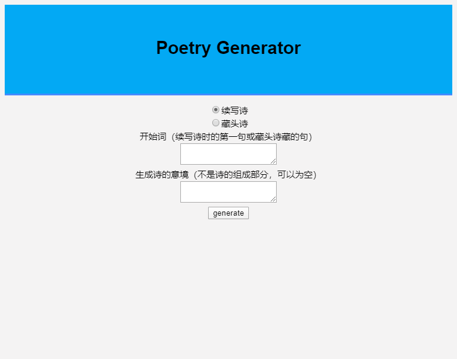

# Poetry Generator   

## 诗歌生成器    

使用pytorch和LSTM模型，实现续写诗词或写藏头诗     
并借助flask上可在浏览器上测试    
> http://127.0.0.1:5000/generator  

html，flask这块是弱项，仅仅实现了功能
<div></div>

环境 ：
- python3.7
- flask 1.1.1
- torch 1.4  

数据源 ：        
[中国诗词](https://github.com/chinese-poetry/chinese-poetry)（直接将其json文件夹放在input文件夹内）

## 模型    

相关参数可在Config.py文件里设置
```python
class PoetryModel(nn.Module):
    def __init__(self, vocab_size, embedding_dim, hidden_dim):
        super(PoetryModel, self).__init__()
        self.hidden_dim = hidden_dim
        self.embedding = nn.Embedding(vocab_size, embedding_dim)    # 词向量层
        self.num_layers = Config['num_layers']
        self.lstm = nn.LSTM(embedding_dim, self.hidden_dim, num_layers=self.num_layers)
        self.linear = nn.Linear(self.hidden_dim, vocab_size)

    def forward(self, x, hidden=None):
        sequence_length, batch_size = x.size()
        if hidden is None:
            h_0 = x.data.new(self.num_layers, batch_size, self.hidden_dim).fill_(0).float()
            c_0 = x.data.new(self.num_layers, batch_size, self.hidden_dim).fill_(0).float()
        else:
            h_0, c_0 = hidden

        # embeds shape (sequence_length, batch_size, embedding_dim )
        embeds = self.embedding(x)

        # output shape (sequence_length, batch_size, hidden_dim*(2 if bidirectional else 1) )
        output, hidden = self.lstm(embeds, (h_0, c_0))

        # output shape (sequence_length*batch, vocab_size)
        output = self.linear(output.view(sequence_length*batch_size, -1))

        return output, hidden
```

## 效果  
### 续写诗词  
以``床前明月光``开头（config.py文件中设置了生成诗词的最大长度）

    床前明月光，悬宫三月时。
    持刀直射楚，为璧黄金葳。
    双双坠解腰，百尺千朵垂。
    自君不及之，轩与兔与丝。
    且有一杯情，使我长思期。
    世情尚多歎，旧态难再持。
    何况杏园树，君是今日池。
    素宴众人见，春风生绿池。
    物物不自辨，羞与醉中移。
    复此花中月，尔我自相依。
    不如花落屋，歎去蝶萦枝。

### 写藏头诗  

    我有一弦歌，自顾有馀滓。
    爱君一曲诗，价以随人杰。
    学非不博物，莫系好风调。
    习之白雪来，系书换人卧。

## 文件说明

|文件|作用|
|:---:|:---:|
|config.py|各项配置|
|data.py|生成合适的训练的数据|
|model.py|主要使用的模型|
|generate.py|生成诗句|
|main.py|训练模型|
|test.py|测试/使用模型生成诗句|
|langconv.py zn_wiki.py| 繁简体转换|
|app.py|flask 入口|

## 参考  
- https://github.com/justdark/pytorch-poetry-gen
- https://github.com/braveryCHR/LSTM_poem
- https://github.com/skydark/nstools/tree/master/zhtools 繁简体转换